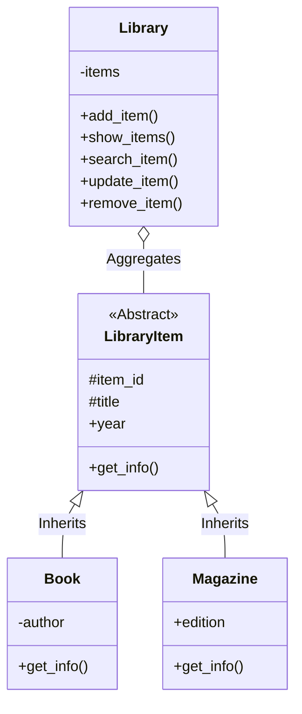

# 📚 Sistem Manajemen Perpustakaan (Python OOP)


Proyek ini adalah implementasi **Object-Oriented Programming (OOP)** untuk simulasi manajemen perpustakaan. Sistem ini dibangun sebagai tugas praktikum untuk mendemonstrasikan pemahaman mengenai 4 pilar utama OOP: *Encapsulation*, *Inheritance*, *Abstraction*, dan *Polymorphism*.

---

## 🛠️ Teknologi & Konsep

Proyek ini menggunakan Python standar tanpa dependensi eksternal, berfokus pada struktur kode yang bersih (*Clean Code*).

| Komponen | Keterangan |
| :--- | :--- |
| **Bahasa** | Python 3.x |
| **Paradigma** | Object-Oriented Programming (OOP) |
| **Interface** | Command Line Interface (CLI) |
| **Design Pattern** | Sederhana (pembuatan objek terpisah) |

### Implementasi OOP
* ✅ **Abstract Class**: `LibraryItem` sebagai blueprint dasar.
* ✅ **Inheritance**: `Book` dan `Magazine` mewarisi `LibraryItem`.
* ✅ **Encapsulation**: Penggunaan `@property`, `@setter`, dan atribut privat (`__author`).
* ✅ **Polymorphism**: Method `get_info()` berbeda pada setiap subclass.

---

## 🏗️ Desain Sistem (Class Diagram)



## 📸 Screenshot Aplikasi

### 1. Tampilan Menu Utama


### 2. Tambah Item


### 3. Tampilkan Item


### 4. Cari Item


### 5. Update Item


### 6. Keluar


---

## ✨ Fitur Utama

* **Interactive CRUD**: Create, Read, Update, dan Delete data Buku/Majalah.
* **Smart Search**: Pencarian berdasarkan Judul (case-insensitive) atau ID unik.
* **Flexible Update**: Update parsial — biarkan kosong untuk mempertahankan nilai lama.
* **Data Integrity**: Validasi ID unik saat penambahan.
* **Demo Mode**: Mode otomatis untuk demonstrasi cepat.

---

## 🚀 Cara Menjalankan

### Prasyarat

Pastikan Python 3.8+ terinstal. Periksa versi dengan:

```bash
python --version
```

### Langkah Singkat

1. Clone atau download repository:

```bash
git clone https://github.com/username-anda/pemrograman_python_itera_123140054.git
```

2. Masuk ke direktori project (sesuaikan path jika perlu):

```bash
cd pemrograman_python_itera_123140054/marcel_123140054_pertemuan5
```

3. Jalankan program:

* Mode interaktif:

```bash
python main.py
```

* Mode demo (non-interaktif):

```bash
python main.py --demo
```

---

## 📂 Struktur File

```text
Marcel Kevin Togap Siagian_123140054 Pertemuan5/
├── main.py        # Source code utama (Class & Logic)
└── README.md      # Dokumentasi proyek
```

---

## 📝 Catatan Penggunaan

* **ID Unik**: Masukkan ID (angka) yang belum digunakan.
* **Validasi Tahun**: Jika memasukkan tahun yang bukan angka saat update, perubahan tahun akan diabaikan.

---

## 👨‍💻 Author

**Marcel Kevin Togap Siagian** - NIM: 123140054  
Teknik Informatika - Institut Teknologi Sumatera (ITERA)

---